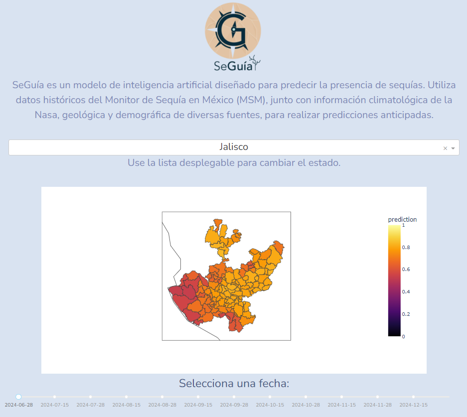
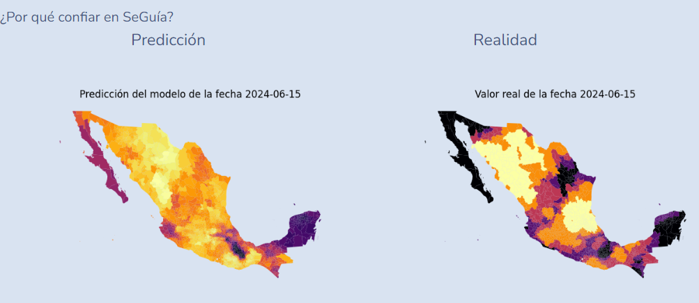

SeGuía es un modelo de inteligencia artificial que identifica las sequías con 6 meses de anticipación.

(Presione la siguiente imagen para ver un video)

Este repositorio es para explorar y desarrollar un modelo de inteligencia artificial
basado en aprendizaje supervisado para detecta sequías con suficiente tiempo de anticipación.

Todo se encuentra dentro de la carpeta `seguia`.

El modelo se puede utilizar a través de una plataforma:

El modelo tiene un 85% de precisión, sus predicciones se acercan mucho a la realidad.

Existe un código QR referenciando diréctamente al repositorio de SeGuía.

